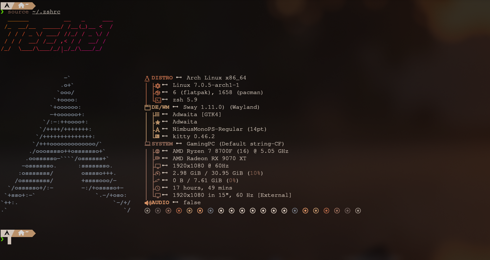

# desktop-dotfiles

My personal dotfiles for my Arch Linux desktop. Running SwayFX on Wayland with Neovim as my editor.



## What's in here

- **sway** — window manager config
- **waybar** — status bar
- **swaylock** — lock screen
- **kitty** — terminal
- **nvim** — Neovim config (LazyVim based)
- **kanshi** — display management
- **fastfetch** — system info
- **btop** — system monitor
- **cava** — audio visualizer
- **lazygit** — git TUI
- **yazi** — file manager
- **zathura** — PDF viewer

## Setup

Clone the repo and symlink the configs to their expected locations. For example:

```bash
ln -s ~/Dotfiles/desktop-dotfiles/.config/sway ~/.config/sway
```

Repeat for each config you want.

## System

- OS: Arch Linux
- WM: SwayFX (Wayland)
- Terminal: Kitty
- Editor: Neovim
- Shell: Zsh + Oh My Zsh
